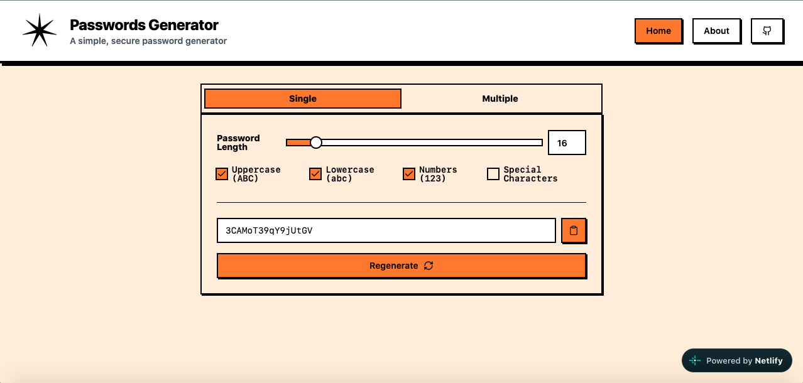
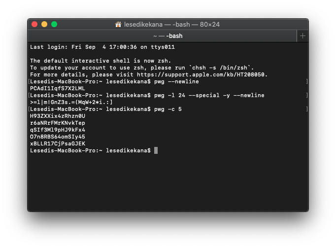

# password-generator (`pwg`)

**A simple, secure password generator**

`password-generator` is a lightweight CLI tool written in Go that generates cryptographically secure passwords. I built this as a side project to replace my reliance on online password generators, and to get hands-on experience with Go and practical security implementations.

I've also built a web version of this password generator at https://lesedi-pw.netlify.app/



## Why?

I’ve been using online tools to generate passwords for a while ([passwordsgenerator.net](https://passwordsgenerator.net/) - which is now shut down, [LastPass](https://www.lastpass.com/features/password-generator), etc), but I was always really skeptical of the security measures and practices of these websites. I didn't know if they were truly client side (and the passwords couldn't be tracked by malicious actors) or if they were truly safe from interception/interference, whether they were truly random, etc.

As a CS grad, equipped with a bunch of knowledge from [my final year Computer Security class](https://www.up.ac.za/yearbooks/2025/EBIT-faculty/UG-modules/view/COS%20330), I figured it was time to build my own. I started with a CLI so I could make sure I got the fundamentals right.

When I tried researching how password generators are actually written under the hood, Google just kept spitting out websites that generate passwords, which wasn't helpful at all. So I had to figure a bunch of things out myself.

I'll honest and say I'm not super passionate about computer security (the course at uni was mostly reading), but I wanted to engage with the security concerns to make this thorough and safe, even if realistically it'll probably only be used by me.

I also chose to write this in Go. I'm trying to familiarise myself with Go more and more. I did consider using Rust because I'd have more control over the memory and I wouldn't have to worry about Go's garbage collector possibly getting in the way but Go was the right choice for my learning goals and getting it down quicker.

I'm aware the *most* secure generation methods would involve doing math straight on the CPU or GPU registers, but I wasn't sure where I'd start with that, and realisitically, I'd probably make a new mistakes trying to re-invent the wheel, so I stuck with Go's `crypto/rand` and focused on what I could control: memory management and clipboard hygiene.

## Web Version

I built a web version of this password generator, which you can find [here](https://lesedi-pw.netlify.app/).

It's built with [Tanstack Start](https://tanstack.com/start/latest) (a high speed Next.js alternative) and uses [Shadcn UI](https://ui.shadcn.com/) components, with [Neobrutalism.dev](https://www.neobrutalism.dev/) styling for a unique & simple look.

The web version is client-side (passwords are securely generated in your browser - no server communication) and uses similar password generation logic as the CLI. Using your browser's native `Crypto.getRandomValues` function for true and secure randomness, and the same rejection sampling method to ensure the password meets your requirements.

The web version does have the drawback of keeping the password in your browser's memory while it's on-screen and the website is open, but is completely safe to use otherwise.

I'm also thinking about making a PWA (Progressive Web App) implementation, so you can install it on your device and use it offline.

## Installation

### Via Releases

You can download pre-built binaries for macOS and Windows from the [latest release](https://github.com/lkekana/password-generator/releases/latest).

#### macOS

1. Download the appropriate archive for your Mac:
   - **Apple Silicon (M1/M2/M3):** `password-generator_Darwin_arm64.tar.gz`
   - **Intel:** `password-generator_Darwin_x86_64.tar.gz`
   
   *You can do this via your browser or directly in the terminal (Apple Silicon example):*
   ```bash
   curl -L -O https://github.com/lkekana/password-generator/releases/latest/download/password-generator_Darwin_arm64.tar.gz
   ```

2. Extract the archive:
   ```bash
   tar -xzf password-generator_Darwin_arm64.tar.gz
   ```

3. Move the binary to your PATH:
   ```bash
   sudo mv password-generator /usr/local/bin/password-generator
   ```

#### Windows

1. Download the appropriate archive for your system (most likely `password-generator_Windows_x86_64.zip`) from the [latest release](https://github.com/lkekana/password-generator/releases/latest).
2. Extract the `.zip` file.
3. Move `password-generator.exe` to a directory that is included in your system's `PATH` environment variable. 

*Here is a quick way to do this using PowerShell:*
```powershell
# 1. Create a local bin directory in your user profile
New-Item -ItemType Directory -Force -Path "$env:USERPROFILE\bin"

# 2. Move the executable (assuming you are in the extracted folder)
Move-Item .\password-generator.exe "$env:USERPROFILE\bin\password-generator.exe"

# 3. Add the directory to your User PATH (if it's not already there)
$currentPath = [Environment]::GetEnvironmentVariable("Path", "User")
if ($currentPath -notlike "*$env:USERPROFILE\bin*") {
    [Environment]::SetEnvironmentVariable("Path", "$currentPath;$env:USERPROFILE\bin", "User")
    Write-Host "Added to PATH. Please restart your terminal to use 'password-generator'."
}
```

### Via Go Install
If you have Go installed, you can easily install the CLI globally using:
```bash
go install github.com/lkekana/password-generator@latest
```

### From Source
Alternatively, you can clone the repository and run it directly:
```bash
git clone https://github.com/lkekana/password-generator.git
cd password-generator

# to install it in your path
go build -trimpath -ldflags="-s -w"
sudo cp passwords-generator /usr/local/bin/

# to run the code, without installing
go run .
```

## Usage

```bash
$ password-generator --help
A simple password generator CLI

Usage:
  password-generator [flags]

Flags:
  -y, --copy         Copy to clipboard (only works when generating a single password)
  -c, --count int    Number of passwords to generate (default 1)
  -d, --debug        Enable debug mode
  -h, --help         help for password-generator
  -l, --length int   Length of the password (default 16)
      --lower        Include lowercase letters (default true)
      --newline      Print a newline after generating a single password (useful for piping output & does not apply when generating multiple passwords)
      --num          Include numbers (default true)
      --special      Include special characters
      --upper        Include uppercase letters (default true)
```

### Examples
```bash
# Generate a standard 16-character password
password-generator

# Generate a 24-character password with special characters and copy it to the clipboard
password-generator -l 24 --special -y

# Generate 5 passwords and print them to stdout
password-generator -c 5
```



## Design Choices & Security Considerations

- **Memory Zeroing:** Because Go uses a Garbage Collector, sensitive data like passwords can linger in memory longer than you'd like. To address this, I implemented a `zeroOutPassword` function paired with `runtime.KeepAlive`. This ensures the password is explicitly overwritten with zeros after it's printed / copied and prevents the compiler from optimizing the zeroing operation away before the GC sweeps it.
- **Regeneration & Modulo Bias (Rejection Sampling):** To ensure the password contains all required character types (upper, lower, numbers, special), the generator creates the full password and checks it against your requirements. If it fails, it throws it out and regenerates. This avoids the predictable patterns and modulo bias that come from forcing specific characters into specific indexes.

## Performance

<details>
<summary>A sample run for 50 passwords (CLI):</summary>

```bash
$ go run . --debug -c 50 -l 24
Debug mode enabled.

=== GENERATOR CONFIGURATION ===
Number of passwords to generate: 50
Length of each password: 24
Include uppercase: true
Include lowercase: true
Include numbers: true
Include special characters: false
===============================

=== CLIPBOARD INFORMATION ===
Clipboard contains data of size: 28 bytes
=============================

Password 1: Gncas5m7DKUpEEn1F9xYvOgp (Execution took 93.648µs)
Password 2: p0aT50ina9AJo0nlk8EpGlMx (Execution took 46.198µs)
Password 3: TW4vpSYqz5lygKFnbrFedo7j (Execution took 46.483µs)
Password 4: rmN4zVjJYLGSxjOLrB4G7TNA (Execution took 46.238µs)
Password 5: gxHIfgj0ozwEz4jY5c5jIiXS (Execution took 43.202µs)
Password 6: WOdx0219iDFGo1ixQsdfTmrZ (Execution took 44.328µs)
Password 7: rHcsAshjYqtT04X1fvuy7zgE (Execution took 42.992µs)
Password 8: vYHa2u4AsXbrlFZMgMOuhWGp (Execution took 46.39µs)
Password 9: 7VtIWIUHudVbT2PxjqEkKiGo (Execution took 43.327µs)
Password 10: Hbx33C3xNDLoIwFpBRmsWXey (Execution took 44.199µs)
Password 11: wHErhZIjMreHXvcCi5tlfYdQ (Execution took 66.13µs)
Password 12: F8OKZVGTt6sVBBGglSKvjmNF (Execution took 46.276µs)
Password 13: MxYp90gbwDs4crkRUMw67uVo (Execution took 42.887µs)
Password 14: MgklnzJ7wAU3HGpe8DYEh0FR (Execution took 44.356µs)
Password 15: E08HF8u8w15uxWqXtBEp6S4I (Execution took 44.947µs)
Password 16: SVm5LjZBz5IH3aw2t4cCDplW (Execution took 44.569µs)
Generated password did not meet requirements, regenerating...
Password 17: oq8xQSrJgaZfeFwt0zB5QitF (Execution took 102.799µs)
Password 18: 7A3iwdtbGMAYxGZuJ9Y2rAdd (Execution took 44.038µs)
Password 19: Tybr6PtomqZDSDBjt5SDlB06 (Execution took 46.469µs)
Password 20: AGflw5emeSzuIZJLk6JGtU8O (Execution took 60.074µs)
Password 21: pLASU7Mf8NlKyFhCw6YxmRxx (Execution took 56.628µs)
Password 22: yEtG8eXJlMRl2t6yLjeR2u1B (Execution took 43.523µs)
Password 23: 2fgkMhvZQ2dJFKm8QuFcc51K (Execution took 40.913µs)
Password 24: yv0PiCFrRvZbwc9DMv9jFc6c (Execution took 30.718µs)
Password 25: qi43pSo0l52gYmSbtsGRUBMv (Execution took 30.572µs)
Password 26: OiDXG9Rn1wKwPD2bTaV07KEl (Execution took 41.936µs)
Password 27: jnp1UEDKNa7T9y4x627fDeEX (Execution took 30.274µs)
Password 28: uJ0gwPK3ARVMugmIOJvBeNnd (Execution took 31.817µs)
Password 29: ySbvaYl8hngW8rFbNVm0Vqix (Execution took 29.556µs)
Password 30: QkCUn1zyiPp3TR1IahDjKvEr (Execution took 34.16µs)
Password 31: EtXmvJvRFDBw2TKEZGxoZzkm (Execution took 46.531µs)
Password 32: tfeAHFw8Lu2bAPxBUazRWx54 (Execution took 32.596µs)
Password 33: XVUJesnseq2HlYVLVcSW66En (Execution took 30.522µs)
Password 34: VrccEjGZ8m9Y4RXeJrMVzUq4 (Execution took 29.777µs)
Password 35: 6qOYcVrzr75V3kTWlIueOnbc (Execution took 29.33µs)
Password 36: A1stMKNr9q0wUoRWNWkOkMAQ (Execution took 31.513µs)
Password 37: QjBN6Shieo8eVSz3Oja2JcF5 (Execution took 30.397µs)
Password 38: WRi3DUQJ6w7Ezd8D0HcSOTKF (Execution took 29.35µs)
Password 39: ZMSPCygX3OfRsrs5Or7zWguT (Execution took 31.661µs)
Password 40: 61zZp2QGly59zElvMn9E9mHB (Execution took 31.409µs)
Password 41: NHqjgMTYItkZOW9tIDyWkirY (Execution took 34.364µs)
Password 42: eM4UIcBViaJYqpBNNIl8Edho (Execution took 49.675µs)
Password 43: rCYqVhT1YxwHynozSmAmvpEN (Execution took 30.78µs)
Password 44: 9VlPHlnJNsWwvqMPxo56yhTP (Execution took 30.535µs)
Password 45: W0iLF1gpqSZKwNapO0W6B3ro (Execution took 29.51µs)
Password 46: vxeyUfxT4YdEpzSD0trSp3CT (Execution took 30.498µs)
Password 47: qHvnWx7Vw2UYh0jjRrZOnSfy (Execution took 30.666µs)
Password 48: mAh0wDY2Scc4UNSLc1868btm (Execution took 29.44µs)
Password 49: z3W2oJpmekuB8VNJJaH4oTrH (Execution took 31.737µs)
Password 50: lB2pBb7JbWlVTyoViIcdEGQk (Execution took 31.452µs)
Total execution time for 50 passwords: 2.41866ms
```

First password takes the longest to generate because of the time needed to create the charset, though it seems that the Golang compiler reuses the charset making subsequent passwords a lot faster.
</details>

<details>
<summary>A sample run for 50 passwords (Web):</summary>

```bash
$ deno run -A web/generator.ts 
Password generation time: 2.12ms
Password generation time (50 passwords): 3.72ms
Password generation time (100 passwords): 8.82ms
```

Similar to the CLI, the first password takes the longest to generate because of the time needed to create the charset, though it also seems that the Deno runtime reuses the charset making subsequent passwords a lot faster.
</details>

## Roadmap

- [ ] **Clipboard Integration:** Possibly re-enable the 10-second clipboard timeout and restore logic across all supported OS environments. I had it implemented but removed it because I just didn't like the UX.
- [x] **Web Version:** Eventually port the core logic to a secure, fully client-side web application (maybe via WebAssembly?) & PWA.
  - [x] **Web Version Clipboard Integration:** Implement clipboard integration for the web version, allowing users to copy generated passwords directly to their clipboard.
  - [ ] **Web Version Password Strength Meter:** Add a password strength meter to the web version, providing users with feedback on the strength of their generated passwords.
  - [ ] **Progressive Web App (PWA) Support:** Enhance the web version to support offline usage and installation on devices as a PWA.
- [ ] **Cross-Platform Notifications:** Add native OS notifications (via `beeep` or similar) when the clipboard is successfully restored. Also tried this out but it was annoying so I disabled it.

## License
This project is licensed under the GNU GPLv3 License. See the [LICENSE](LICENSE) file for details.
